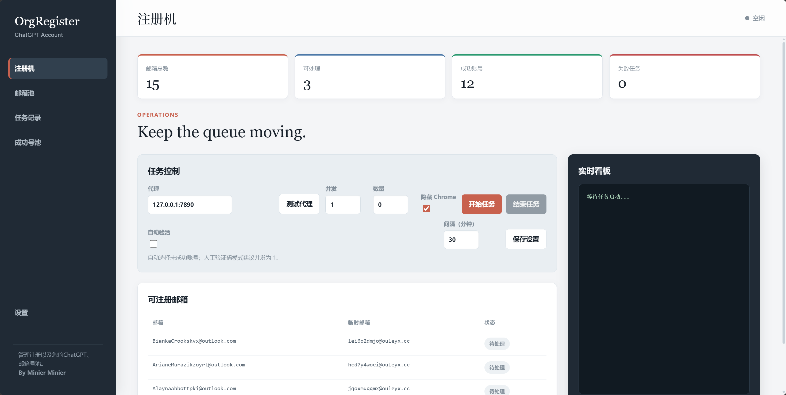

<div align="center">


**A local account-registration and operations workspace for authorized testing**

[](https://www.python.org/)
[](https://fastapi.tiangolo.com/)
[](https://github.com/Kaliiiiiiii-Vinyzu/patchright)
[](#license-and-use-boundaries)

[中文](README.md) · [English](README.en.md)

</div>

> A service for automating ChatGPT account registration and obtaining Session Tokens, Access Tokens, and Session JSON.

## Overview

OrgRegister is a local account-registration and operations dashboard for managing tasks, email verification codes, proxies, account health, and local data in explicitly authorized test environments.

It brings repetitive browser actions, mailbox polling, and task history into a lightweight FastAPI + SQLite application. It is suitable for development, workflow validation, QA regression, and internal automation experiments.

## Features

- **Task workspace**: create tasks, view live progress, keep task history, and clear all history with one action.
- **Success pool**: inspect account status, registration dates, and detailed fields in cards; expand structured details or remove an account.
- **Email verification**: poll verification codes through Graph/IMAP mail adapters without publishing mailbox contents.
- **Browser workflow**: launch Chromium with Patchright, proxy support, timeouts, and manual CAPTCHA handling.
- **Runtime visibility**: display service state, browser environment, fingerprint information, and task logs for failure analysis.

## Screenshots



## Quick start

### Requirements

| Dependency | Version |
| --- | --- |
| Python | 3.10 or newer |
| Chromium | Installed by Patchright |
| Operating system | Windows, macOS, or Linux |

### Install and run

```powershell
cd C:\path\to\Reg-pub
python -m venv .venv
.\.venv\Scripts\Activate.ps1
pip install -r requirements.txt
patchright install chromium
python run.py
```

Open <http://127.0.0.1:8001>.

On Linux/macOS, activate the virtual environment with:

```bash
source .venv/bin/activate
```

### Configure the mailbox pool

Copy the example file and fill it locally with your own test credentials:

```powershell
Copy-Item data\emails.example.txt data\emails.txt
```

Each line contains six fields separated by four hyphens:

```text
MS_EMAIL----MS_PASSWORD----MS_UUID----MSA_REFRESH_TOKEN----TEMP_EMAIL----TEMP_PASSWORD
```

`data/emails.txt` is included in `.gitignore`. Never commit real credentials or paste them into Git, issues, screenshots, logs, or chat messages.

## Configuration

Core settings live in [`backend/config.py`](backend/config.py):

| Setting | Default | Description |
| --- | --- | --- |
| `HOST` | `127.0.0.1` | Listen on the local machine only |
| `PORT` | `8001` | Web service port |
| `DEFAULT_PROXY` | `127.0.0.1:7890` | Default HTTP proxy |
| `MAX_CONCURRENT` | `2` | Default task concurrency |
| `REGISTER_TIMEOUT` | `300` | Per-task timeout in seconds |
| `CAPTCHA_TIMEOUT` | `600` | Manual CAPTCHA wait time in seconds |

Before production or multi-user deployment, add authentication, TLS, access controls, and audit logging. The defaults are intended for a controlled local environment.

## Project layout

```text
Reg-pub/
├─ backend/              # FastAPI service, registration, mail, and proxy adapters
├─ frontend/             # Dashboard, i18n, styles, and management actions
├─ data/
│  ├─ emails.example.txt # Sanitized credential format example
│  └─ .gitkeep
├─ tests/                # Unit tests
├─ run.py                # Application entry point
├─ requirements.txt
└─ README*.md
```

## Verification

```powershell
python -m unittest discover -s tests -q
python -m compileall -q backend run.py tests
node --check frontend/manage-actions.js
```

## License and use boundaries

[Orgnol Series] This project is intended only for testing and reverse-engineering research. Do not use it for illegal purposes. By Minier Buper
